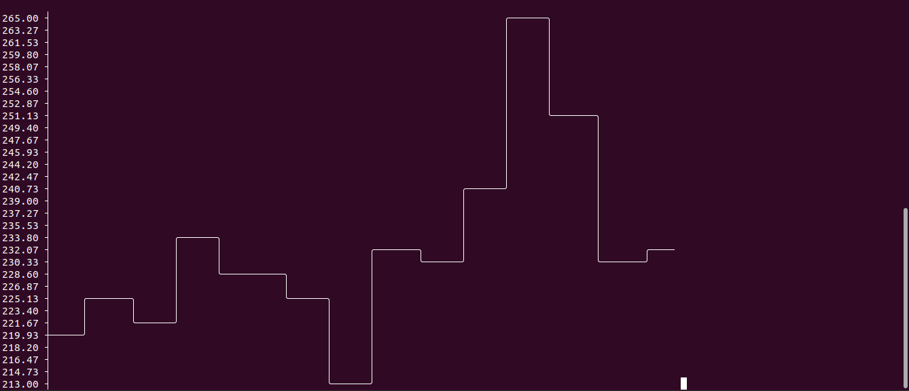

# Geo Home API CLI Graph

Display live usage data from your Geo Home account in your terminal.

Built with Node.js. Uses the geotogether.com API.

Note that this is a completely unofficial project which is not endorsed or recommended by GEO (Green Energy Options Ltd).

## Usage

- `git clone git@github.com:jamiesoncj/geo-home-live-data-terminal.git`
- `cd geo-home-live-data-terminal`
- `npm install`
- `node index.js -u <username> -p <password>`

## Options

- username `-u` Geo Home username (required)
- password `-p` Geo Home password (required)
- system `-s` System ID (optional, will be determined from your account if not specified) - usually a UUID
- refresh `-r` Refresh interval in seconds (optional). Default: 30.
- output `-o` Output type (optional). Valid values: chart, text. Default: chart
- width `-w` Width of chart (optional). Uses terminal window columns as default. Recommended value: 100
- height `-h` Height of chart (optional). Uses terminal window rows as default. Recommended value: 10
